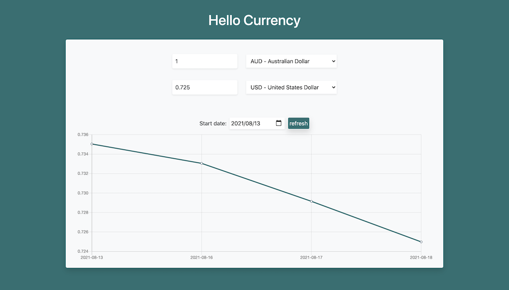

# Hello Currency

[](https://hellocurrency.netlify.app)<br><br>

## Project setup

```
yarn install
```

### Compiles and hot-reloads for development

```
yarn serve
```

### Compiles and minifies for production

```
yarn build
```

### Lints and fixes files

```
yarn lint
```

### Main feature

-   [x] Vuex
-   [x] Chart.js - Line Chart
-   [x] Frankfurter currency exchange rate API
